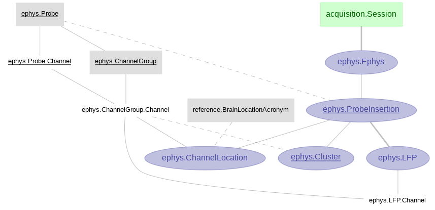

# IBL pipeline schemas

Alyx-corresponding schemas, including, `referenall_erd.save('/images/all_erd.png')ce`, `subject`, `action`, `acquisition`, and `data`


Schema of `ephys`


Schema of `behavior`


# Instructions for connecting to the IBL pipeline

1. Email austin@vathes.com for a database username.

2. Install Docker (https://www.docker.com/). Linux users also need to install Docker Compose separately.

3. Fork the repository (https://github.com/int-brain-lab/IBL-pipeline) onto your own GitHub account.

4. Clone the forked repository.

5. Create a .env file in the cloned directory and **modify user and password values** per Step 1.

    File contents of ``.env``:
    ```
    DJ_HOST=datajoint.internationalbrainlab.org
    DJ_USER=username
    DJ_PASS=password
    ```

6. Copy your `.one_params` file into `IBL-pipeline/root` to not be prompted for Alyx login.

7. Move into the cloned directory in a terminal, then run `docker-compose up -d`.

Note: if you first build the docker container and then add `.one_params`, running ONE() in Python may still prompt you for your Alyx and FlatIron login details. In this case, do
```
docker-compose down
docker image rm ibl-pipeline_datajoint:latest
docker-compose up -d
docker exec -it ibl-pipeline_datajoint_1 /bin/bash
```

### To run example notebooks ###

8. Go to http://localhost:8888/tree in your favorite browser to open Jupyter Notebook.

9. Open "Datajoint pipeline query tutorial.ipynb".

10. Run through the notebook and feel free to experiment.

### To run your own Python scripts ###

8. If the user would like to enter the docker and run scripts through the terminal, run 
```
docker-compose up -d
docker exec -it ibl-pipeline_datajoint_1 /bin/bash
cd /src/ibl-pipeline/ibl_pipeline/analyses
```

To save figures into AlyxPlots on the Google Drive, you can mount this path to somewhere inside the docker. The save the figs into the docker folder. The saved results will be automatically present in the outside folder you mounted.

a. `docker-compose down`
b. open `docker-compose.yml`
c. add `/Users/urai/Google Drive/Rig building WG/DataFigures/BehaviourData_Weekly/Snapshot_DataJoint/:/Snapshot_DataJoint` in to the volumes:
d. close the file
e. `docker-compose up -d`

Then save the plots into `/AlyxPlots` inside the docker, then you’ll see that the plots are in the folder you want.

# Instructions to ingest Alyx data into local database

To run an local instance of database in the background, run the docker-compose command as follows:

```bash
docker-compose -f docker-compose-local.yml up -d
```

This will create a docker container with a local database inside. To access the docker from the terminal, first get the docker container ID with `docker ps`, then run:

```bash
docker exec -it CONTAINER_ID /bin/bash
```

Now we are in the docker, and run the bash script for the ingestion:

```
bash /src/ibl-pipeline/scripts/ingest_alyx.sh ../data/alyx_dump/2018-10-30_alyxfull.json
```

Make sure that the json file is in the correct directory as shown above.

To turn stop the containers, run:

```bash
docker-compose -f docker-compose-local.yml down
```


# Instructions to ingest Alyx data into Amazon RDS

To insert Alyx data into the remote Amazon RDS, create a .env file in the same directory of your `docker-compose.yml`, as instructed in Step 4 above. 

Now run the docker-compose as follows, it will by default run through the file `docker-compose.yml`

```bash
docker-compose up -d
```

This will create a docker container and link to the remote Amazon RDS. Then follow the same instruction of ingestion to the local database.
